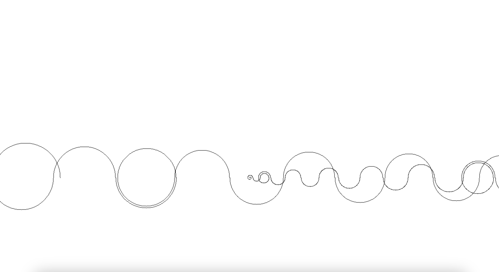

# Recaman Sequence Visualizer

#### *Written in C using SDL2, and utilizes Adaptive Replacement Cache*

This project visualizes the Recaman sequence using SDL2 and C. The program generates the sequence, prints it to the console, and then draws the sequence using SDL2 graphics.

## Table of Contents
- [Recaman Sequence Visualizer](#recaman-sequence-visualizer)
  - [Table of Contents](#table-of-contents)
  - [Requirements](#requirements)
  - [Installation](#installation)
  - [Usage](#usage)
  - [Code Overview](#code-overview)
  - [Visualization](#visualization)

## Requirements

- GCC
- SDL2

## Installation

1. Install SDL2:
    - For Homebrew (macOS):
      ```sh
      brew install sdl2
      ```

2. Clone this repository or download the source files.

3. Compile the code:
    ```sh
    gcc -o recaman_visualizer main.c -I/opt/homebrew/Cellar/sdl2/2.30.3/include -L/opt/homebrew/Cellar/sdl2/2.30.3/lib -lSDL2
    ```

## Usage

Run the executable with a positive integer as an argument to generate and visualize that many terms of the Recaman sequence:
```sh
./recaman_visualizer <positive integer>
```

Example:

```sh
./recaman_visualizer 100
```

## Code Overview

- printArray: Prints the generated Recaman sequence to the console.
- recInSequence: Checks if a term is already in the sequence.
- recamanRecursively: Recursively generates the Recaman sequence.
- addToCache: Adds a term to the cache, ensuring it doesn't exceed the cache size.
- drawArc: Draws an arc on the SDL renderer.
- drawRecaman: Draws the Recaman sequence using SDL graphics.

## Visualization

The program uses SDL2 to create a window and render the Recaman sequence. The arcs are drawn alternately above and below the horizontal axis to represent the sequence visually.

